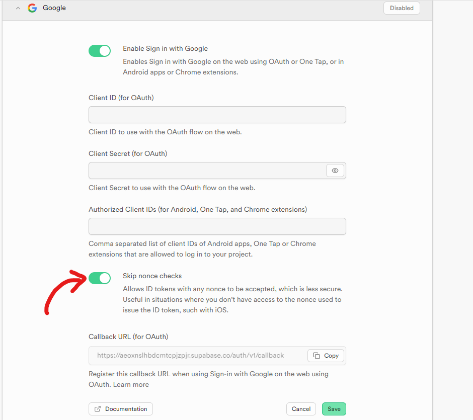
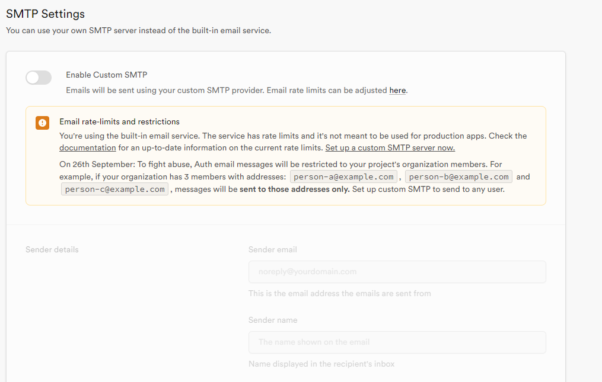

# Nest JS template

## Project structure

```
.
├── .api-client <- autogenerated api client
├── config <- configurations for migrations and environment variables
├── database/
│   └── migrations <- database migrations goes here
└── src/
    ├── core <- logging, validation, error handling modules
    ├── lib  <- code that may be fully separated from the app
    ├── modules/
    │   └── example/
    │       ├── application/
    │       │   ├── dto <- data transfer objects
    │       │   ├── exceptions <- application exceptions
    │       │   ├── services <- interfaces of services
    │       │   ├── use-cases <- abstractions and implementation of use-cases
    │       │   └── handlers <- event handlers
    │       ├── domain/
    │       │   ├── entities <- something with id
    │       │   ├── value-objects <- object that represent simple structure without id or logic
    │       │   ├── enums <- enumerations
    │       │   ├── repositories <- repository interfaces
    │       │   └── events <- domain events classes
    │       └── infrastructure/
    │           ├── controllers <- rest controllers
    │           ├── handlers <- infrastructure event handlers
    │           └── persistence <- database related logic/
    │               └── drizzle/
    │                   ├── mappers
    │                   └── repositories
    └── shared <- contains all base implementation and database schema
```

## Getting started

1. Install dependencies

```bash
pnpm install
```

2. Generate and run migrations

To do so, you will need to make DB_URL variable available in your environment

Windows:

```bash
$env:DB_URL="db url here"
```

Unix:

```bash
export DB_URL="db url here"
```

```bash
pnpm run db:generate

pnpm run db:push
```

3. Run the app

```bash
pnpm run start:dev
```

## Configuration

You can introspect or extends available configuration in `AppConfigModel` [here](./src/shared/application/models/app-config.model.ts).
It defines validation using class-validator. Implicit type coercion is enabled, so strings may be converted to number, boolean or other types.

To define env variables, you may just add them into your bash environment or define them in `.env` `.env.local` files.

### Supabase auth configuration

To configure supabase auth, you need to provide following variables:

```bash
SUPABASE_URL=???
SUPABASE_SECRET_KEY=???
JWT_SECRET=??? # used for signing jwt tokens by supabase
```

Also, we support google oauth2, which requires additional configuration:
Go to **Authentication** > **Providers** > **Google**
Enable Google auth and provide `clientId` and `clientSecret`

Additionally, for GitHub OAuth2 configuration:

1. Go to **Authentication** > **Providers** > **GitHub**
2. Enable GitHub auth and provide `clientId` and `clientSecret`
3. Important: Enable the "Skip nonce checks" option

> :warning: **Warning**: Enabling "Skip nonce checks" is necessary for Google OAuth to work properly with Supabase.



---

Also, due to new supabase policies, only users in your organization will receive emails from supabase SMTP. For broader testing and production, don't forget to set up your own SMTP server.



### Stripe billing setup

To setup stripe billing, you need to provide following variables:

```bash
STRIPE_API_KEY=???
STRIPE_WEBHOOK_SIGNING_SECRET=???
```

To add products you will be required to do it through stripe UI.

To make a product available in the list retrieved from the API, you need to set a specific metadata key-value pair in the Stripe UI:

> :warning: **Warning**: Only products with the metadata key "type" set to "plan" will be returned by the API. This is a current limitation and may change in future updates. We are considering implementing a script to seed products automatically, which would streamline this process. This behavior is implemented in `StripeSubscriptionPlanService`: `listPlans` and `getPlanById` methods.

**How we store billing data**:
We don't store products on our side, to avoid synchronization issues and errors. Payment customer data and subscription details are stored in our database.

## Database

Currently we are using drizzle ORM with postgres. We define database schema in `src/shared/infrastructure/database/schema/public-database-schema.ts` file.
To keep our system stable we utilize database transactions. To do so, we use unit of work pattern. This pattern is implemented in DrizzleDbContext class, that creates and provides repositories to our use-cases.

See the example of repositories creation [here](./src/shared/infrastructure/database/drizzle/db-context/drizzle-db-context.ts)

```tsx
private initRepositories() {
  this._userRepository = new DrizzleUserRepository(this._db);
  this._paymentCustomerRepository = new DrizzlePaymentCustomerRepository(this._db);
}
```

> :warning: **Important Note**: Transactions are not implemented yet in the current version of DrizzleDbContext.

> The current implementation of DrizzleDbContext does not provide transaction functionality. Methods like `startTransaction()`, `commitTransaction()`, and `rollbackTransaction()` are placeholders and do not perform actual database transactions. This limitation should be considered when working with the database, especially for operations that require atomic transactions.
> Future updates will aim to implement proper transaction support to ensure data integrity and consistency across multiple database operations.

## Deployment

To deploy our app and api client you will need to do the next:

### API client deployment

To deploy api client, create .npmrc file in the api/.api-client folder with the next content:

```bash
@org:registry=https://npm.pkg.github.com
//npm.pkg.github.com/:_authToken=GITHUB_TOKEN_WITH_ACCESS_TO_OUR_NPM_REGISTRY
```

To get github token with access to our npm registry, you need to go to [github.com/settings/tokens](https://github.com/settings/tokens) and create new personal access token with `repo` and `read:packages` scopes.

Don't forget to change package name to your project-specific name in `package.json` file.

After that you will be able publish api client:

```bash
cd api/.api-client
pnpm publish
```

### Deploying API

All deployment IaC terraform and github workflows are pre-defined in the repository.
You will need to just change app name in terraform code and workflow files.

API and Web are deploying as single app: api is available at `/api` path and web at `/` path.
